# Micro SaaS Booking and Scheduling Application - Design Document

## 1. Project Overview

### 1.1 Purpose
Design and implement a web-based booking and scheduling application that enables users to share their availability and allow others to book appointments with them, similar to Calendly.com. This MVP focuses on core scheduling functionality using an internal database system without third-party calendar integrations.

### 1.2 Target Users
- **Primary Users**: Professionals, consultants, coaches, and service providers who need to schedule appointments with clients
- **Secondary Users**: Clients and visitors who book appointments through shared booking links

### 1.3 Core Value Proposition
Eliminate scheduling back-and-forth by providing a self-service booking interface where users can set their availability once and share a link for others to book available time slots automatically.

## 2. System Architecture

### 2.1 High-Level Architecture

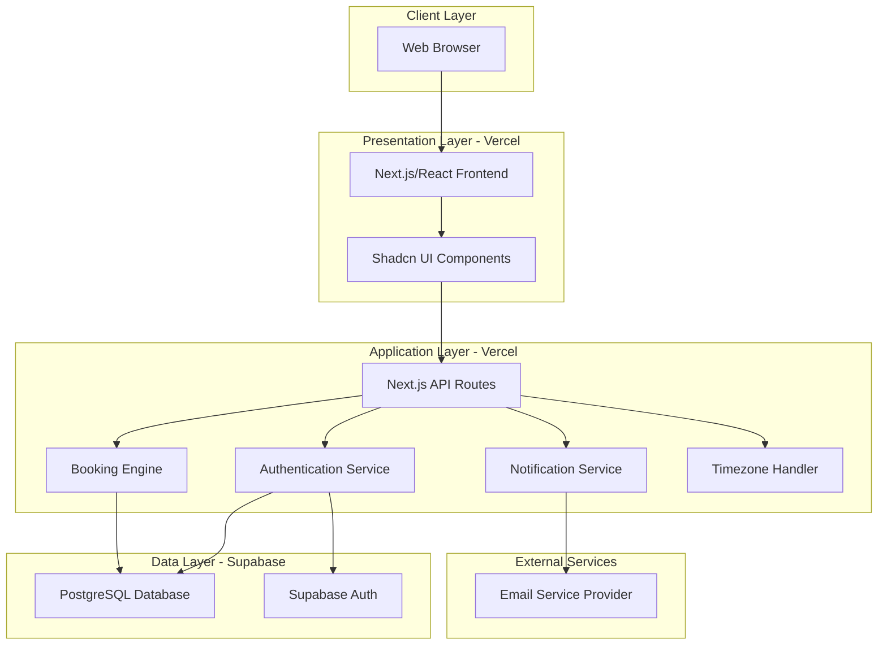

### 2.2 Technology Stack

| Layer | Technology |
|-------|------------|
| Hosting Platform | Vercel |
| Frontend Framework | Next.js 14+ with App Router |
| UI Component Library | Shadcn UI (Radix UI + Tailwind CSS) |
| Styling | Tailwind CSS |
| Backend | Next.js API Routes (Serverless Functions) |
| Database | Supabase (PostgreSQL) |
| Authentication | Supabase Auth |
| Real-time Features | Supabase Realtime (optional) |
| Storage | Supabase Storage (for future file uploads) |

| Email Service | Resend |
| Timezone Handling | date-fns-tz or Luxon |
| Form Handling | React Hook Form with Zod validation |
| State Management | React Context API or Zustand |

### 2.3 Deployment Architecture

**Vercel Platform Benefits**:
- Automatic HTTPS and SSL certificates
- Edge Network for global CDN distribution
- Automatic deployments from Git repository
- Preview deployments for pull requests
- Serverless functions with zero configuration
- Built-in analytics and monitoring

**Supabase Integration**:
- Managed PostgreSQL database with connection pooling
- Built-in authentication with multiple providers
- Row Level Security (RLS) for data protection
- Automatic API generation from database schema
- Real-time subscriptions for live updates
- Database migrations with version control

## 3. Data Model Design

### 3.1 Core Entities

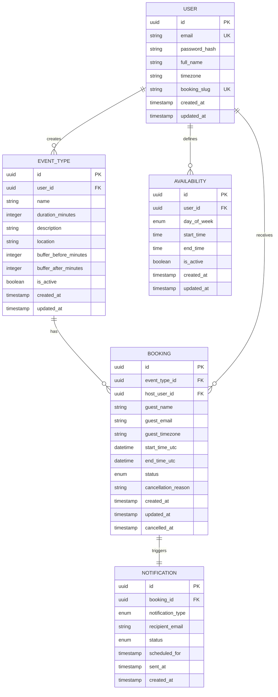

### 3.2 Entity Descriptions

#### User
Represents registered users who can create event types and receive bookings.

| Field | Type | Constraints | Description |
|-------|------|-------------|-------------|
| id | UUID | PRIMARY KEY | Unique identifier |
| email | String | UNIQUE, NOT NULL | User email for login |
| password_hash | String | NOT NULL | Hashed password |
| full_name | String | NOT NULL | Display name |
| timezone | String | NOT NULL | IANA timezone identifier |
| booking_slug | String | UNIQUE, NOT NULL | URL-friendly username for public booking page |
| created_at | Timestamp | NOT NULL | Account creation timestamp |
| updated_at | Timestamp | NOT NULL | Last update timestamp |

#### Event Type
Defines types of meetings a user offers for booking.

| Field | Type | Constraints | Description |
|-------|------|-------------|-------------|
| id | UUID | PRIMARY KEY | Unique identifier |
| user_id | UUID | FOREIGN KEY, NOT NULL | References User |
| name | String | NOT NULL | Event type name |
| duration_minutes | Integer | NOT NULL, MIN 15 | Meeting duration |
| description | Text | NULLABLE | Event details |
| location | String | NULLABLE | Meeting location or platform |
| buffer_before_minutes | Integer | DEFAULT 0 | Time before meeting |
| buffer_after_minutes | Integer | DEFAULT 0 | Time after meeting |
| is_active | Boolean | DEFAULT TRUE | Enable/disable event type |
| created_at | Timestamp | NOT NULL | Creation timestamp |
| updated_at | Timestamp | NOT NULL | Last update timestamp |

#### Availability
Defines weekly recurring availability windows for a user.

| Field | Type | Constraints | Description |
|-------|------|-------------|-------------|
| id | UUID | PRIMARY KEY | Unique identifier |
| user_id | UUID | FOREIGN KEY, NOT NULL | References User |
| day_of_week | Enum | NOT NULL | MONDAY-SUNDAY |
| start_time | Time | NOT NULL | Start time in user timezone |
| end_time | Time | NOT NULL | End time in user timezone |
| is_active | Boolean | DEFAULT TRUE | Enable/disable availability slot |
| created_at | Timestamp | NOT NULL | Creation timestamp |
| updated_at | Timestamp | NOT NULL | Last update timestamp |

#### Booking
Represents a scheduled appointment between host and guest.

| Field | Type | Constraints | Description |
|-------|------|-------------|-------------|
| id | UUID | PRIMARY KEY | Unique identifier |
| event_type_id | UUID | FOREIGN KEY, NOT NULL | References Event Type |
| host_user_id | UUID | FOREIGN KEY, NOT NULL | References User (host) |
| guest_name | String | NOT NULL | Guest full name |
| guest_email | String | NOT NULL | Guest email address |
| guest_timezone | String | NOT NULL | Guest IANA timezone |
| start_time_utc | DateTime | NOT NULL | Booking start in UTC |
| end_time_utc | DateTime | NOT NULL | Booking end in UTC |
| status | Enum | NOT NULL | CONFIRMED, CANCELLED, COMPLETED |
| cancellation_reason | Text | NULLABLE | Reason for cancellation |
| created_at | Timestamp | NOT NULL | Booking creation timestamp |
| updated_at | Timestamp | NOT NULL | Last update timestamp |
| cancelled_at | Timestamp | NULLABLE | Cancellation timestamp |

#### Notification
Tracks email notifications sent for bookings.

| Field | Type | Constraints | Description |
|-------|------|-------------|-------------|
| id | UUID | PRIMARY KEY | Unique identifier |
| booking_id | UUID | FOREIGN KEY, NOT NULL | References Booking |
| notification_type | Enum | NOT NULL | CONFIRMATION, REMINDER, CANCELLATION |
| recipient_email | String | NOT NULL | Email recipient |
| status | Enum | NOT NULL | PENDING, SENT, FAILED |
| scheduled_for | Timestamp | NOT NULL | When to send notification |
| sent_at | Timestamp | NULLABLE | Actual send timestamp |
| created_at | Timestamp | NOT NULL | Creation timestamp |

### 3.3 Data Integrity Rules

- A User can have multiple Event Types and Availability windows
- Each Booking must reference a valid Event Type and Host User
- Availability slots must not have start_time >= end_time
- Booking end_time_utc must be after start_time_utc
- Booking slots cannot overlap for the same host user (enforced at application level)
- Deleted Event Types should soft-delete or prevent deletion if bookings exist

## 4. Core Feature Specifications

### 4.1 User Authentication

#### 4.1.1 Sign Up Flow

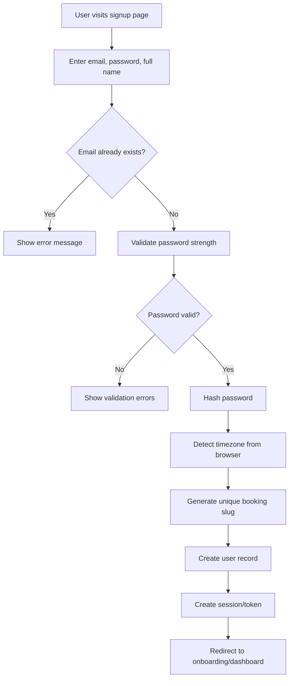

**Validation Requirements**:
- Email must be valid format and unique
- Password minimum 8 characters with mix of letters and numbers
- Full name required, minimum 2 characters
- Booking slug auto-generated from name, ensured unique
- Timezone auto-detected from browser, user can modify later

#### 4.1.2 Login Flow

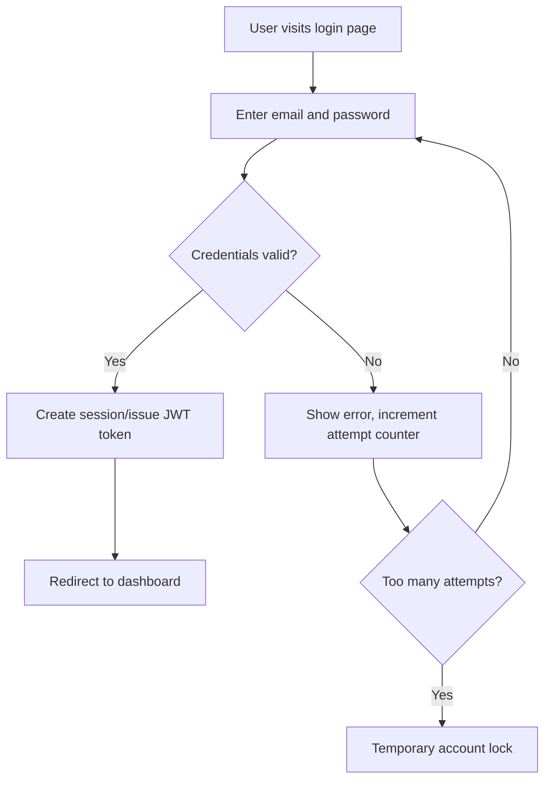

**Security Measures**:
- Rate limiting on login attempts
- Supabase Auth handles secure password hashing (bcrypt)
- HTTPS required for all authentication endpoints (automatic with Vercel)
- JWT tokens managed by Supabase with configurable expiration
- CSRF protection on form submissions
- Supabase Row Level Security (RLS) policies for database access control

#### 4.1.3 Password Reset Flow

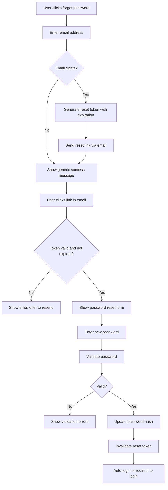

**Reset Token Requirements**:
- Token expires after 1 hour
- Single-use only
- Cryptographically secure random generation
- Generic response for non-existent emails to prevent email enumeration

### 4.2 Availability Management

#### 4.2.1 Weekly Schedule Configuration

Users define their availability by creating time windows for each day of the week.

**Functional Requirements**:
- Users can add multiple availability windows per day
- Each window has start time and end time in user's timezone
- Users can enable/disable specific availability windows
- Default suggestion: 9 AM - 5 PM weekdays
- Minimum slot duration: 15 minutes
- Overlapping windows are prevented

**User Interface Behavior**:
- Visual weekly calendar grid display
- Click-and-drag to create availability blocks
- Toggle switches to enable/disable entire days
- Time picker components with timezone display
- Copy availability from one day to another

#### 4.2.2 Timezone Handling Strategy

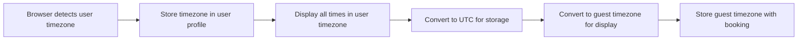

**Timezone Conversion Rules**:
- Availability stored as time-only in user's timezone
- Bookings stored as datetime in UTC
- Display times converted to viewer's timezone
- DST transitions handled automatically
- Timezone displayed alongside all times

### 4.3 Booking Interface

#### 4.3.1 Public Booking Page Structure

Each user has a public URL: `/book/{booking_slug}/{event_type_id}`

**Page Components**:
1. Host information display
2. Event type details (duration, description, location)
3. Calendar month view
4. Available time slots for selected date
5. Guest information form
6. Booking confirmation

#### 4.3.2 Availability Calculation Flow

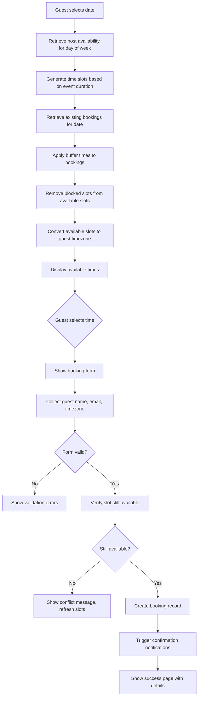

**Slot Availability Algorithm**:
1. Get host availability windows for selected date's day of week
2. Generate candidate slots at event duration intervals
3. Exclude past times if today's date
4. Retrieve all CONFIRMED bookings for the date
5. Apply buffer_before and buffer_after to each booking
6. Remove overlapping time ranges from candidate slots
7. Return list of available start times

**Race Condition Prevention**:
- Optimistic locking on booking creation
- Re-verify availability immediately before confirming
- Transaction isolation for booking creation
- Show error and refresh if slot taken between selection and submission

### 4.4 Event Types Management

#### 4.4.1 Event Type Configuration

Users can create multiple event types with different characteristics.

**Configurable Properties**:

| Property | Type | Purpose | Example |
|----------|------|---------|---------|
| Name | String | Display title | "30-Minute Consultation" |
| Duration | Integer | Meeting length in minutes | 30, 60, 90 |
| Description | Text | Event details for guests | "Quick intro call to discuss your needs" |
| Location | String | Meeting venue or platform | "Zoom", "Phone", "Office" |
| Buffer Before | Integer | Minutes before meeting | 5, 10, 15 |
| Buffer After | Integer | Minutes after meeting | 5, 10, 15 |
| Active Status | Boolean | Enable/disable booking | true/false |

**Buffer Time Behavior**:
- Buffer times prevent back-to-back bookings
- Not visible to guest, only affects availability
- Creates breathing room between appointments
- Example: 30-min meeting with 10-min buffer after blocks 40 minutes total

#### 4.4.2 Event Type URL Structure

Each event type gets a unique booking URL:
- Format: `/book/{user_booking_slug}/{event_type_id}`
- User can share different URLs for different event types
- Event type must be active to accept bookings

### 4.5 Notification System

#### 4.5.1 Notification Types and Triggers

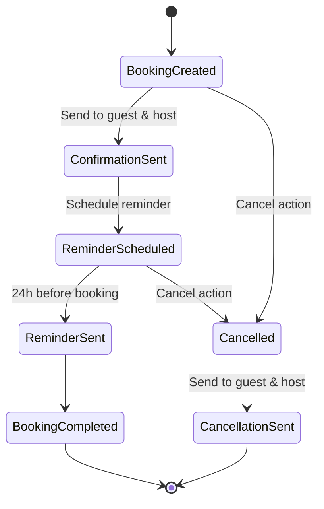

**Notification Matrix**:

| Notification Type | Trigger Event | Recipients | Timing |
|------------------|---------------|------------|---------|
| Booking Confirmation | New booking created | Guest + Host | Immediate |
| Booking Reminder | 24 hours before start | Guest + Host | 24h before start_time |
| Cancellation Notice | Booking cancelled | Guest + Host | Immediate |
| Reschedule Confirmation | Booking rescheduled | Guest + Host | Immediate |

#### 4.5.2 Email Content Requirements

**Confirmation Email Contents**:
- Event type name and duration
- Date and time in recipient's timezone
- Host and guest names
- Meeting location/platform details
- Add to calendar link (ICS file attachment)
- Cancellation/reschedule link
- Contact information

**Reminder Email Contents**:
- "Your meeting is tomorrow" subject line
- All booking details
- Join link if virtual meeting
- Reschedule or cancel options

**Cancellation Email Contents**:
- Cancellation confirmation
- Original booking details
- Cancellation reason if provided
- Link to rebook if desired

#### 4.5.3 Notification Delivery Strategy

- Queue-based email sending to prevent blocking
- Retry logic for failed sends
- Track delivery status in Notification entity
- Scheduled job checks for pending reminders
- Email templates with variable interpolation

### 4.6 Dashboard

#### 4.6.1 Dashboard Layout Structure

The dashboard serves as the central hub for authenticated users.

**Main Sections**:

1. **Overview Panel**
   - Count of upcoming bookings
   - Count of past bookings this month
   - Quick access to create event type
   - Shareable booking link display

2. **Upcoming Appointments Tab**
   - List view of future bookings sorted chronologically
   - Each booking shows: guest name, event type, date/time, status
   - Actions: View details, Cancel, Reschedule
   - Filter by event type
   - Search by guest name or email

3. **Past Bookings Tab**
   - Historical bookings sorted reverse chronologically
   - Shows completed and cancelled bookings
   - Read-only view of details
   - Export functionality for records

4. **Quick Actions Panel**
   - Copy booking link button
   - Create new event type
   - Edit availability
   - Account settings link

#### 4.6.2 Booking Management Operations

**Cancel Booking Flow**:

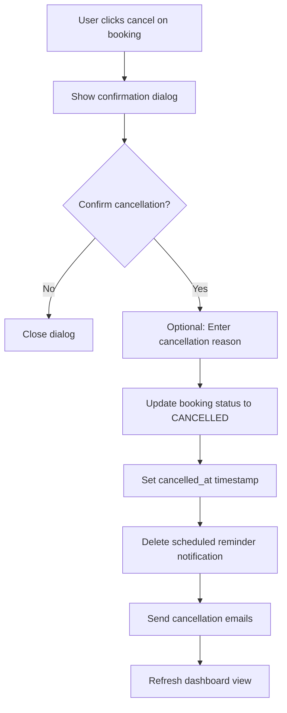

**Reschedule Booking Flow**:

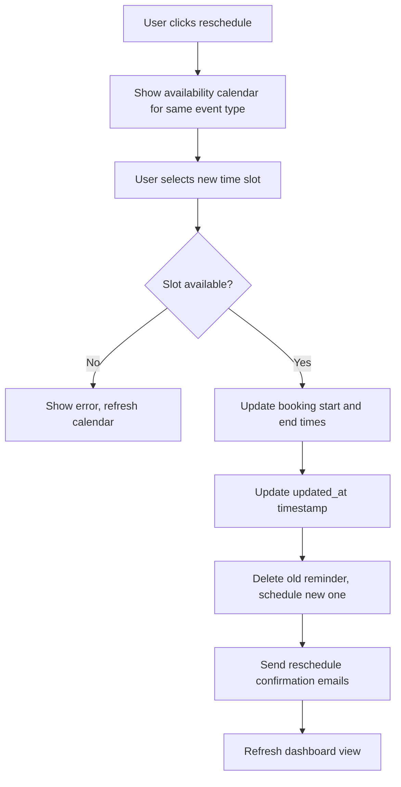

**Business Rules**:
- Only future bookings can be cancelled or rescheduled
- Cancellations can occur up to the start time
- Rescheduling maintains same guest and event type
- Host can cancel any of their bookings
- Guest can cancel via unique link in email

## 5. API Design

### 5.1 API Architecture Principles

- Next.js API Routes for serverless backend functions
- RESTful resource-based endpoints
- JSON request and response payloads
- HTTP status codes for response indication
- Authentication via Supabase JWT tokens
- Versioned API paths (e.g., `/api/v1/...`)
- Consistent error response format
- Direct Supabase client integration for database operations
- Server-side rendering (SSR) and static generation where applicable

### 5.2 Authentication Endpoints

| Method | Endpoint | Purpose | Auth Required |
|--------|----------|---------|---------------|
| POST | `/api/v1/auth/signup` | Create new user account | No |
| POST | `/api/v1/auth/login` | Authenticate user | No |
| POST | `/api/v1/auth/logout` | End user session | Yes |
| POST | `/api/v1/auth/forgot-password` | Request password reset | No |
| POST | `/api/v1/auth/reset-password` | Complete password reset | No |
| GET | `/api/v1/auth/me` | Get current user profile | Yes |
| PUT | `/api/v1/auth/me` | Update user profile | Yes |

### 5.3 Availability Endpoints

| Method | Endpoint | Purpose | Auth Required |
|--------|----------|---------|---------------|
| GET | `/api/v1/availability` | Get current user availability | Yes |
| POST | `/api/v1/availability` | Create availability window | Yes |
| PUT | `/api/v1/availability/{id}` | Update availability window | Yes |
| DELETE | `/api/v1/availability/{id}` | Delete availability window | Yes |

### 5.4 Event Type Endpoints

| Method | Endpoint | Purpose | Auth Required |
|--------|----------|---------|---------------|
| GET | `/api/v1/event-types` | List user's event types | Yes |
| POST | `/api/v1/event-types` | Create new event type | Yes |
| GET | `/api/v1/event-types/{id}` | Get event type details | Yes |
| PUT | `/api/v1/event-types/{id}` | Update event type | Yes |
| DELETE | `/api/v1/event-types/{id}` | Delete event type | Yes |

### 5.5 Public Booking Endpoints

| Method | Endpoint | Purpose | Auth Required |
|--------|----------|---------|---------------|
| GET | `/api/v1/public/users/{slug}` | Get public user profile | No |
| GET | `/api/v1/public/event-types/{id}` | Get public event type info | No |
| POST | `/api/v1/public/availability/check` | Get available slots for date range | No |
| POST | `/api/v1/public/bookings` | Create new booking | No |

### 5.6 Booking Management Endpoints

| Method | Endpoint | Purpose | Auth Required |
|--------|----------|---------|---------------|
| GET | `/api/v1/bookings` | List user's bookings with filters | Yes |
| GET | `/api/v1/bookings/{id}` | Get booking details | Yes |
| PUT | `/api/v1/bookings/{id}/cancel` | Cancel booking | Yes |
| PUT | `/api/v1/bookings/{id}/reschedule` | Reschedule booking | Yes |
| GET | `/api/v1/bookings/export` | Export bookings as CSV | Yes |

### 5.7 Error Response Format

All error responses follow consistent structure:

**Structure**:
- `status`: HTTP status code
- `error`: Error type identifier
- `message`: Human-readable error description
- `details`: Optional array of specific validation errors

**Common Error Codes**:
- 400: Bad Request - validation errors
- 401: Unauthorized - authentication required
- 403: Forbidden - insufficient permissions
- 404: Not Found - resource doesn't exist
- 409: Conflict - resource conflict (e.g., time slot taken)
- 429: Too Many Requests - rate limit exceeded
- 500: Internal Server Error - server-side error

## 6. User Interface Design

### 6.1 Responsive Design Requirements

- Mobile-first approach for booking interface
- Tailwind CSS default breakpoints: sm (640px), md (768px), lg (1024px), xl (1280px)
- Touch-friendly controls for calendar and time selection
- Progressive enhancement for advanced features
- Accessibility compliance (WCAG 2.1 Level AA)
- Shadcn UI components built with Radix UI primitives for accessibility
- Dark mode support via Tailwind CSS dark mode utilities

### 6.2 Key UI Components

#### 6.2.1 Calendar Component
- Month view with navigation arrows
- Highlight current date
- Disable past dates
- Visual indicators for available/unavailable dates
- Responsive grid layout
- Use Shadcn Calendar component or react-day-picker
- Customizable with Tailwind CSS utilities

#### 6.2.2 Time Slot Selector
- Grid or list view of available times
- Display times in viewer's timezone
- Highlight selected slot
- Disable slots as they become booked
- Loading states during availability check

#### 6.2.3 Booking Form
- Guest name input field (Shadcn Input component)
- Guest email input with validation (Shadcn Input component)
- Timezone selector with auto-detection (Shadcn Select component)
- Optional notes/message field (Shadcn Textarea component)
- Clear call-to-action button (Shadcn Button component)
- Form validation with inline errors using React Hook Form and Zod
- Loading states with Shadcn Skeleton components

#### 6.2.4 Dashboard Tables
- Sortable columns (date, guest, event type) using Shadcn Table component
- Pagination for large datasets with Shadcn Pagination component
- Search and filter controls with Shadcn Input and Select
- Action buttons per row using Shadcn Button and DropdownMenu
- Empty states with helpful guidance using custom components
- Loading states with Shadcn Skeleton components

#### 6.2.5 Availability Editor
- Weekly grid view showing all days
- Time range inputs for each availability window
- Add/remove buttons for multiple windows per day
- Bulk operations (copy to other days, clear day)
- Save confirmation with validation

### 6.3 Page Flow Map

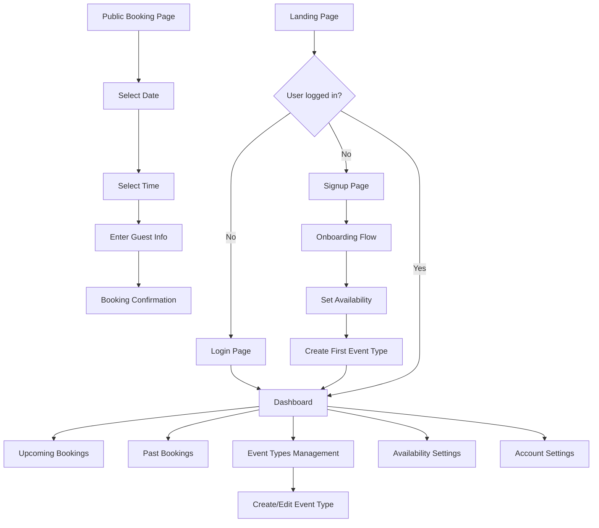

## 7. Security Considerations

### 7.1 Authentication Security

- Supabase Auth manages password hashing with bcrypt
- Secure session management with httpOnly cookies via Supabase
- JWT tokens with configurable expiration managed by Supabase
- CSRF protection via Supabase Auth libraries
- Rate limiting on authentication endpoints using Vercel Edge Config or Upstash Redis
- Account lockout after failed login attempts (configured in Supabase)
- Password strength requirements enforced via Supabase Auth policies
- Supabase Row Level Security (RLS) for fine-grained access control

### 7.2 Authorization Rules

- Users can only view/edit their own data
- Public booking endpoints validate event type belongs to specified user
- Booking cancellation requires ownership verification or guest email match
- API endpoints validate user permissions before data access
- Prevent horizontal privilege escalation through ID enumeration

### 7.3 Data Protection

- HTTPS/TLS for all communications (automatic with Vercel)
- Input validation and sanitization on all endpoints using Zod schemas
- SQL injection prevention through Supabase client parameterized queries
- XSS protection through React's built-in output encoding
- Sensitive data (passwords) managed by Supabase Auth, never exposed
- Email addresses validated before sending
- PII handling complies with data protection regulations
- Supabase RLS policies enforce data access boundaries
- Environment variables managed securely via Vercel Environment Variables

### 7.4 Public Endpoint Security

- Rate limiting on booking creation to prevent abuse
- CAPTCHA or bot detection for public booking forms
- Validate timezone inputs against known IANA list
- Prevent spam bookings through email verification option
- Limit booking lookhead window (e.g., max 60 days out)

## 8. Non-Functional Requirements

### 8.1 Performance Targets

- Page load time under 2 seconds on standard broadband
- Initial page load optimized with Next.js static generation and edge caching
- API response time under 500ms for 95th percentile
- Serverless functions execute within Vercel's 10-second limit
- Availability calculation completes within 1 second
- Support 100+ concurrent users leveraging Vercel's auto-scaling
- Database queries optimized with appropriate indexes in Supabase
- Connection pooling managed by Supabase for optimal performance
- Image optimization via Next.js Image component and Vercel Image Optimization

### 8.2 Scalability Considerations

- Stateless serverless functions auto-scale with traffic on Vercel
- Supabase manages database connection pooling automatically
- Next.js caching strategy for public user profiles and event types
- Edge caching via Vercel CDN for static and dynamic content
- Asynchronous email sending via Vercel Cron Jobs or third-party queue service
- Supabase Database Functions for complex server-side logic
- Incremental Static Regeneration (ISR) for semi-static booking pages

### 8.3 Reliability Requirements

- 99.9% uptime SLA from Vercel and Supabase
- Automatic database backups with point-in-time recovery via Supabase
- Transaction management for booking creation using Supabase database transactions
- Graceful error handling with user-friendly messages using Shadcn Toast component
- Monitoring via Vercel Analytics and Supabase Dashboard
- Error tracking with Sentry or Vercel Error Monitoring
- Health check endpoints for API routes

### 8.4 Maintainability Standards

- Clear separation of concerns following Next.js App Router conventions
- Server Components and Client Components properly distinguished
- Consistent code formatting with Prettier and ESLint
- TypeScript for type safety across the application
- Comprehensive logging for debugging via Vercel logs
- Environment-based configuration using Vercel Environment Variables
- Database migrations managed through Supabase Migration system
- API versioning strategy for future changes
- Component documentation with Storybook (optional)
- Automated testing with Jest and React Testing Library

## 9. Future Enhancements (Out of MVP Scope)

The following features are explicitly excluded from the MVP but documented for future consideration:

### 9.1 Advanced Scheduling Features
- Team scheduling with round-robin or collective availability
- Group events with multiple attendees
- Recurring booking templates
- Booking questions and intake forms
- Conditional logic for event type availability

### 9.2 Integration Capabilities
- Google Calendar synchronization
- Microsoft Outlook integration
- Zoom meeting auto-creation
- Third-party video conferencing platforms
- Webhook notifications for external systems

### 9.3 Payment Processing
- Paid booking support with Stripe integration
- Deposit collection for appointments
- Refund handling for cancellations
- Invoice generation

### 9.4 Enhanced User Experience
- Mobile native applications
- Multiple language support (i18n)
- Custom branding and white-labeling
- Embedded booking widgets for websites
- SMS notifications in addition to email

### 9.5 Analytics and Reporting
- Booking analytics dashboard
- No-show tracking
- Revenue reporting for paid bookings
- Conversion rate metrics
- Export reports in multiple formats

## 10. Implementation Phases

### Phase 1: Foundation (Weeks 1-2)
- Next.js project setup with TypeScript and Tailwind CSS
- Shadcn UI component library installation and configuration
- Supabase project creation and configuration
- Database schema implementation in Supabase
- Supabase Auth integration for user authentication
- Basic user profile management
- Vercel project setup and deployment pipeline
- Environment variables configuration

### Phase 2: Core Scheduling (Weeks 3-4)
- Availability management interface with Shadcn components
- Event type creation and management forms
- Timezone handling implementation with date-fns-tz
- Public booking page structure with Next.js dynamic routes
- Row Level Security policies in Supabase
- API routes for availability and event type operations

### Phase 3: Booking Engine (Weeks 5-6)
- Availability calculation algorithm in serverless functions
- Booking creation flow with transaction support
- Real-time slot availability checking with Supabase queries
- Calendar UI components using Shadcn Calendar
- Form validation with React Hook Form and Zod
- Optimistic UI updates with React state management

### Phase 4: Notifications and Management (Weeks 7-8)
- Email notification system with Resend or SendGrid
- Booking confirmation email templates
- Dashboard with bookings list using Shadcn Table
- Cancel and reschedule functionality with confirmation dialogs
- Reminder scheduling with Vercel Cron Jobs
- Toast notifications for user feedback using Shadcn Toast

### Phase 5: Polish and Testing (Weeks 9-10)
- Responsive design refinement across all breakpoints
- Dark mode implementation and testing
- End-to-end testing with Playwright or Cypress
- Security audit including Supabase RLS policy review
- Performance optimization and Lighthouse score improvements
- SEO optimization with Next.js metadata API
- Documentation completion
- Production deployment to Vercel with custom domain
- Database performance tuning in Supabase

## 11. Success Criteria

The MVP will be considered successful when:

- Users can register, login, and manage their profiles
- Users can define weekly availability schedules
- Users can create at least one event type
- Public booking pages display correct available time slots
- Guests can successfully book appointments
- Confirmation emails are sent to both host and guest
- Users can view upcoming and past bookings in dashboard
- Users can cancel and reschedule bookings
- System correctly handles timezone conversions
- All booking operations prevent double-booking
- Application meets security best practices
- Responsive design works on mobile, tablet, and desktop devices
